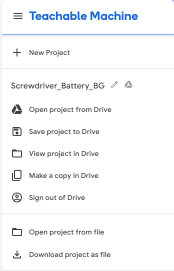
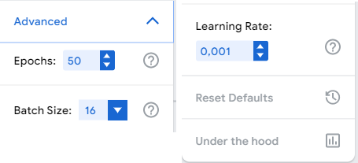
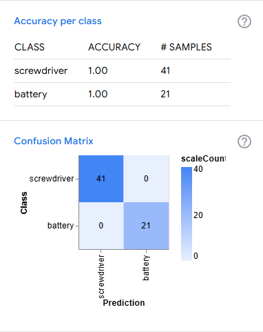
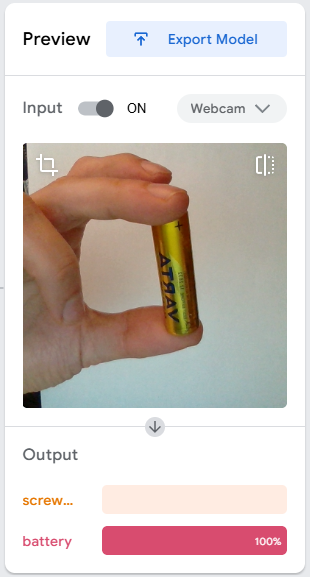
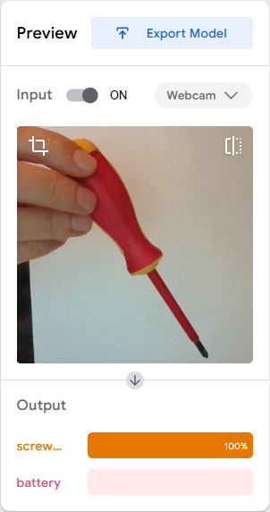
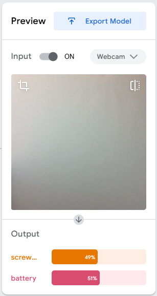
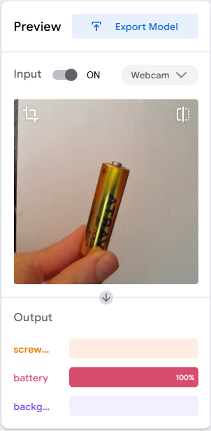
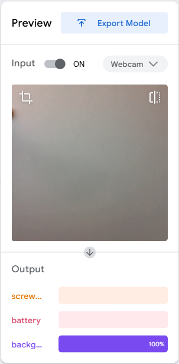

# MLprojects - Google Teachable Machine

[Google Teachable Machine](https://teachablemachine.withgoogle.com/) is a user-friendly web-based tool that allows anyone to train and use custom machine learning models without the need for coding expertise.

Google Teachable Machine is used in a wide range of fields, from education and research to prototyping and hobby projects. Examples include classifying objects in images, recognizing audio cues, or detecting poses in videos. It is particularly valuable for quick experimentation and bringing ML-powered solutions to life without requiring advanced technical skills.

Key Features: based on a set of images or using a web camera, the images can serve as information for the training model(s).

Options are: 
- image / sound based classification for 1-2-... classes
- image based posture (key body point) recognition

Ease of Use: Create models for image recognition, audio classification, or posture detection by providing examples in an interactive interface. 3 simple video tutorial guides you through the required steps.

Export Options: Trained models can be exported for use in web applications, mobile apps, or other projects. Tensorflow (python, js), Keras, Android, Coral.ai supported (2024/12)

Accessibility: Designed to make machine learning accessible to educators, students, and hobbyists, therefore easy to do the first step.

A powerful resource for quick prototyping and creative experimentation.

# Training
Using Google Teachable Machine involves three main steps:

Collect Examples: Users provide training data by recording or uploading example images/sound samples for different categories. Here you find image/video based models only, sound model was not created (yet).

Train the Model: With one click, the platform trains a custom machine learning model using the provided examples. Of course there are settings option that may be adjusted, but in that case read the notes and know what you do! ;)

Models in these projects were created with . Models can be found as .tm files in the corresponding project's 'model' folder.

Export and Use: The trained models were exported and can be integrated into various applications, such as websites, mobile apps, or hardware projects.
For TensorFlow, TensorFlow Lite, python/js scripts, and Android/Coral.ai compatible codes see example files in the __tm-screwdriver-battery-model/src__ folder.

An *under-the-hood* option can give insight in the change of the variables during training (showing the developing saturation curves) or the final result's *Accuracy* or *Confusion matrix* can be checked.

# Models

## 1) tm-apple_classifier-model 
The uploaded image based model for classification of fine/rotten apples, including test images.
Images can be found in the images folder. Two sets of images are for training and for testing purpose.
Model: in themodel folder
Further images in the main folder of the project show some steps of the model training.

## 2) tm-screwdriver-battery-model
Images were captured by webcamera in case of screwdriver / battery for video based recognition. Two models were created, one with and another without recognizing empty (background) images.
Recognition on video: continuous on-line classification.
However using a white (paper) background is not the most appropriate way of "removing disturbing" background, but this trick was tested in this project.

Frankly saying if none of the objects were on screen but there were not related objects in the background the simple 2-class screwdriver/battery classification showed none zero probability of recognizing one or the other element. The convincing classification cases:

In case of no objects, but a white background classification showed non-zero match for one of the class-types, see image above. This induced the creation of the upgraded 3-class screwdriver/battery/(white) background classification model.

Of course the model has limitations, but it was proven usable. 

Further images in the main folder of the project show some steps of the model training.

Why do I have the object in hand, not only the objects on the images? Because that's more realistic that someone holds an object to the camera in a Factory to recognise an item. Objects do not levitate! :D 