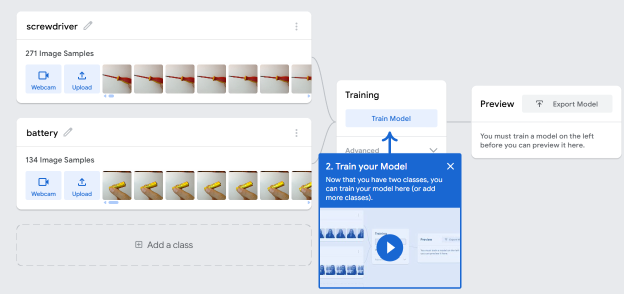

# MLprojects
Collection of Machine Learning projects, models, scripts, info

# Machine Learning Models

This directory contains machine learning models developed and trained for diverse applications. The models included here are based on free-to-use, easy-access services, such as the Google Teachable Machine. Simple processes of building and deploying these ML-powered solutions opens the opportunity to build similar models for everyone. The following examples may be reused, tested, but I encourage everyone to make his/her own ML project using your own choice.
In general links to the original service providers are provided, but web search can easily drop you to the right place, if link is not given.

## Google Teachable Machine

[Google Teachable Machine](https://teachablemachine.withgoogle.com/) is a user-friendly web-based tool that allows anyone to train and use custom machine learning models without the need for coding expertise.

Key Features: based on a set of images or using a web camera, the images can serve as information for the training model(s).

Options are: 
- image / sound based classification for 1-2-... classes
- image based posture (key body point) recognition

Ease of Use: Create models for image recognition, audio classification, or posture detection by providing examples in an interactive interface. 3 simple video tutorial guides you through the required steps.

Export Options: Trained models can be exported for use in web applications, mobile apps, or other projects. Tensorflow (python, js), Keras, Android, Coral.ai supported (2024/12)
[Save&Share&Open Model](./Google_TeachableMachine/save_open_share_options_m.png)

Accessibility: Designed to make machine learning accessible to educators, students, and hobbyists, therefore easy to do the first step.

A powerful resource for quick prototyping and creative experimentation.

Folders: [Teachable Machine Models](./Google_TeachableMachine/README.md)
1) tm-apple_classifier-model - image based model for classification of fine/rotten apples, including test images
2) tm-screwdriver-battery-model - video camera captured images for screwdriver / battery recognition, models with and without recognizing empty (background) images. Recognition on video: continuous on-line classification.

## Lobe

[Lobe](https://www.lobe.ai/examples) is a user-friendly Machine Learning tool developed by Microsoft that enables users to create custom machine learning models without needing to write code. Lobe offers a drag-and-drop interface for training models, primarily focused on tasks like image classification. It automatically handles much of the machine learning workflow, including data preprocessing, model training, and evaluation.

Lobe is particularly appealing to beginners and non-developers, as it simplifies the creation of ML models.

Export Options: Trained models can be exported to formats compatible with common platforms, such as TensorFlow, ONNX, or CoreML, for integration into apps or other systems.

Find more information in the lobeai_info.txt in the [Lobe](./Lobe/README.md) folder.

## SciKit Image - image processing examples
Collection of image processing projects, using different *SciKit image* tools in notebooks.

[SciKitImage](./SciKitImage/README.md) folder.

## CUDA in Python on Google Colab (Notebook)
Notebook to demonstrate how to configure and run C++ code with CUDA acceleration using Google Colab(oratory) GPU or TPU.

in folder: 'CUDA'

## Webscraping + language detection
Simple webscraping projects targeting _Jooble_ job market webpage. Language detection uses the langdetect python pretrained module to verify the language of the posted job.

A short code for demonstartional purposes how to webscrape directly the Jooble job market in the USA, using Jooble API. Unfortunately the API key cannot be used for other countries! (see instructions in file how to get it)

[Webscraping](webscraping/README.md)

## LLMs
Projects using Large Language Models for different tasks. *Google* and *HuggingFace *involved.

[LLMs](LLMs/README.md)