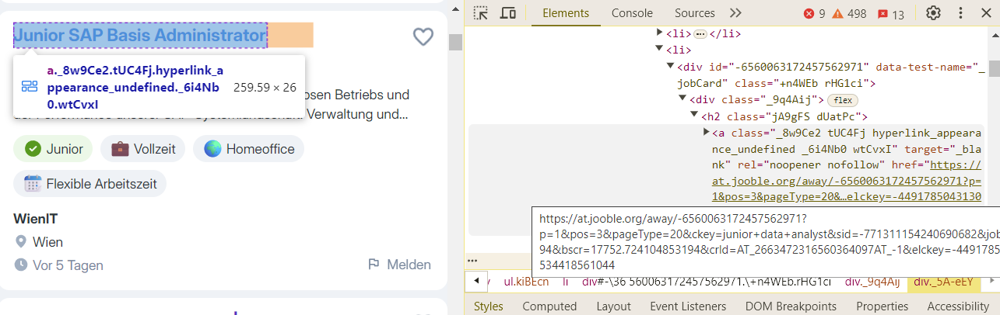
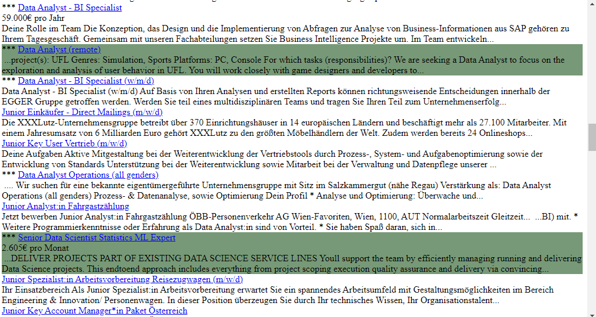

# MLprojects - Jooble JOB search webscraping with language detection (ML)

Jooble Job Search webpage (downloaded local file) scraper for simplifying reading
 the results, with some added highlight for keywords / language.

1. Extract the required `
` tags that match the specific `class` value 
(`data-test-name="_jobCard" class="+n4WEb rHG1ci"`).
2. Within those tags, locate `<a>` anchors matching the provided class and extract 
the entire anchor tag, including the `href` attribute.
3. Extract the content of `
` and `
`.
4. Create a new HTML document and add each collected part of the data as separate 
paragraphs inside a new `
`.
5. Save the generated file and open it in the browser.

The Python code using `requests` to fetch the page, `BeautifulSoup` to parse the HTML, 
and `html` to generate the output:

### Steps and Explanation:
0. **Save Jooble job search**: Make a search (after login) on Jooble with your keywords 
and settings and download the webpage. This way there is no need for authentication for 
software access to Jooble search data.
Implement OAuth2.0 authentication for Jooble, if you wish.
1. **Fetch the Website Content**: The `requests.get(url)` fetches the HTML content from 
the provided URL (local filepath).
2. **Parse HTML**: The `BeautifulSoup(response.content, 'html.parser')` parses the HTML 
so that we can search for specific elements.
3. **Find Job Cards**: We search for `
` tags that match both the `data-test-name` 
and the `class` attributes you provided.
4. **Extract Data**: For each `job_card`, we extract:
    - The `<a>` tag with the specific class and include the full anchor HTML tag.
    - The contents of the `
` and `
`.
5. **Save Output**: The gathered data is written to a new HTML file in the format you 
requested. The `<a>` tag is pasted as-is, while other text contents are added as paragraphs.
6. **Open the File**: After the web scraping is complete, the generated HTML file is 
opened in the default web browser.

### Dependencies:
- **BeautifulSoup4**: Install it using `pip install beautifulsoup4`.
- **langdetect**: language detection (Machine learning, based on a Google ML) module, install using pip if missing
- re, datetime are typically involved in Python basic module package

dependencies:
1)    try in python (IDE) shell/command line:
import langdetect
import BeautifulSoup
and if some fails install it
2) 
pip install langdetect
pip install BeautifulSoup

**Note**: Jooble may vary the tags, codes on the website, therefore if the software fails to run
due to error(s) in finding predefined html tags, then use F12 mode in your browser
and search key values which determines the required content to extract -> update the codes in this app.

Created on Wed Jan 15 17:40:16 2025
@author: Josesan77
 
Determining keywords/values in Jooble website html for finding tags with Beautifulsoup: 

example run output: 

and
webscraped_jooble_at20250115_2324.html